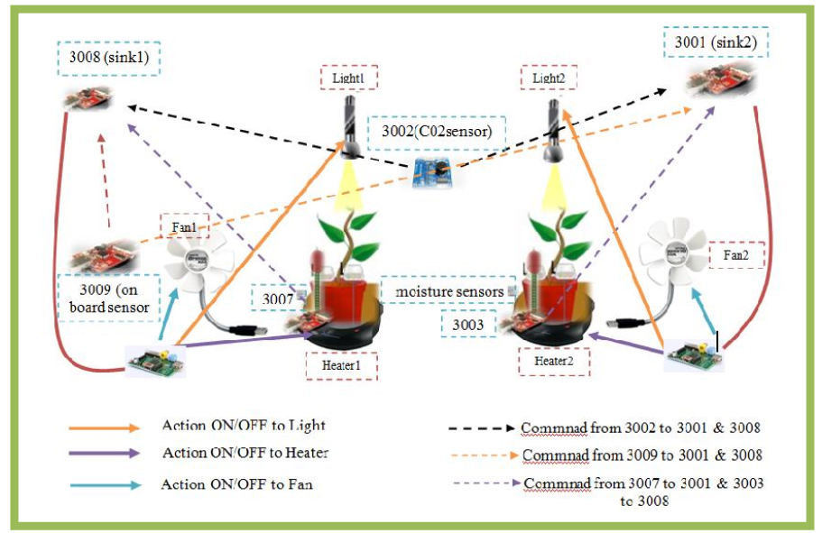

# uMundo_distrubuted_app
To build a sensing system for the plants in order to monitor their living conditions. As per the sensed
values perform actuation and perform data visualization of the received sensed values.

* Software used: C/C++, Contiki, Cooja, TUDμNet, 
* Hardware used: XM1000, VH400 and DS1000 sensors.

